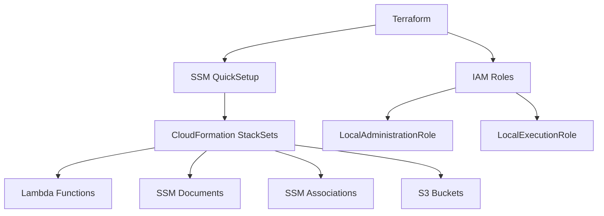

# AWS SSM Quick Setup - Terraform Automation

[](https://www.terraform.io/)
[](https://registry.terraform.io/providers/hashicorp/aws/latest)
[](LICENSE)

Terraform Infrastructure as Code (IaC) for automating AWS Systems Manager (SSM) Quick Setup Configuration Manager with Patch Policy. This project automates the deployment of patch scanning across AWS resources using AWS-managed patch baselines.

## 📋 Table of Contents

- [Overview](#overview)
- [Architecture](#architecture)
- [Prerequisites](#prerequisites)
- [Quick Start](#quick-start)
- [Configuration](#configuration)
- [Deployment](#deployment)
- [Verification](#verification)
- [Troubleshooting](#troubleshooting)
- [Clean Up](#clean-up)
- [Contributing](#contributing)
- [License](#license)

## 🎯 Overview

This Terraform project deploys:

- **SSM QuickSetup Configuration Manager** with automated patch scanning
- **IAM Roles** for QuickSetup administration and execution
- **Dynamic Patch Baseline Mapping** for all AWS default patch baselines
- **CloudFormation StackSets** for resource provisioning
- **Lambda Functions** for patch policy automation
- **S3 Buckets** for logging (optional)

### Key Features

- ✅ **Automated Patch Scanning** - Daily scans at 01:00 UTC
- ✅ **Multi-OS Support** - Covers 15+ operating systems (Amazon Linux, Ubuntu, Windows, RHEL, etc.)
- ✅ **Scan-Only Mode** - No automatic patching (configurable)
- ✅ **Rate Control** - 10% concurrency, 2% error threshold
- ✅ **Single Region** - Designed for us-east-1 (easily adaptable)
- ✅ **IAC Best Practices** - Full Terraform automation with proper state management

## 🏗️ Architecture

### Core Components



### Data Flow

1. **Data Sources** retrieve AWS account info, region, partition, and available patch baselines
2. **Locals** transform patch baseline data into QuickSetup's required JSON format
3. **IAM Roles** provide necessary permissions for QuickSetup operations
4. **Configuration Manager** orchestrates the deployment of patch scanning infrastructure

## 📦 Prerequisites

### Required

- **Terraform** >= 1.0
- **AWS CLI** configured with appropriate credentials
- **AWS Account** with admin permissions
- **IAM Permissions** to create roles and policies

### AWS Provider Configuration

This project uses AWS Provider version `~> 6.0` which includes support for `aws_ssmquicksetup_configuration_manager`.

## 🚀 Quick Start

### 1. Clone the Repository

```bash
git clone <repository-url>
cd aws-ssm
```

### 2. Configure Variables

```bash
cp main.tfvars.example main.tfvars
# Edit main.tfvars with your desired configuration
```

### 3. Configure AWS Credentials

```bash
# Option 1: AWS CLI profile
export AWS_PROFILE=your-profile

# Option 2: Environment variables
export AWS_ACCESS_KEY_ID="your-access-key"
export AWS_SECRET_ACCESS_KEY="your-secret-key"
export AWS_REGION="us-east-1"
```

### 4. Initialize Terraform

```bash
terraform init
```

### 5. Plan Deployment

```bash
terraform plan -var-file=main.tfvars
```

### 6. Deploy

```bash
terraform apply -var-file=main.tfvars
```

## ⚙️ Configuration

### Variables

| Variable | Type | Description | Default |
|----------|------|-------------|---------|
| `name` | `string` | Name of the SSM QuickSetup Configuration Manager | Required |
| `patch_policy_name` | `string` | Name of the Patch Policy | Required |

### Patch Policy Settings

Default configuration (defined in `ssmquicksetup.tf`):

- **Operation**: `Scan` (read-only, no patching)
- **Schedule**: `cron(0 1 * * ? *)` - Daily at 01:00 UTC
- **Rate Control Concurrency**: 10%
- **Rate Control Error Threshold**: 2%
- **Target Scope**: All resources (`TargetType: "*"`)
- **Logging**: S3 logging disabled by default

### Customization

To modify the patch policy behavior, edit `ssmquicksetup.tf`:

```hcl
parameters = {
  "ConfigurationOptionsPatchOperation" : "Scan",  # Change to "Install" for auto-patching
  "ConfigurationOptionsScanValue" : "cron(0 1 * * ? *)",  # Modify schedule
  # ... other parameters
}
```

## 📁 Project Structure

```
aws-ssm/
├── data.tf                          # Data sources (account, region, partition, patch baselines)
├── iam.tf                           # IAM roles and policies for QuickSetup
├── locals.tf                        # Local values (patch baseline JSON transformation)
├── main.tfvars                      # Variable values (gitignored)
├── main.tfvars.example              # Example variable configuration
├── provider.tf                      # AWS provider configuration
├── ssmquicksetup.tf                 # SSM QuickSetup Configuration Manager
├── variables.tf                     # Variable definitions
├── .gitignore                       # Git ignore rules
├── README.md                        # This file
├── README-TROUBLESHOOTING.md        # Detailed troubleshooting guide
└── SOLUCAO-RESUMO.md                # Solution summary (Portuguese)
```

## ✅ Verification

### Terraform State

```bash
# List managed resources
terraform state list

# Show Configuration Manager details
terraform state show aws_ssmquicksetup_configuration_manager.this
```

### AWS Console

1. Navigate to **AWS Console** → **Systems Manager** → **Quick Setup**
2. Verify the configuration status shows **"Deployment: SUCCEEDED"**

### AWS CLI

```bash
# List SSM associations created
aws ssm list-associations

# Check patch compliance
aws ssm describe-instance-patch-states-for-patch-group \
  --patch-group "patch-policy-group"

# View created Lambda functions
aws lambda list-functions --query 'Functions[?starts_with(FunctionName, `baseline-overrides`) || starts_with(FunctionName, `delete-name-tags`)]'
```

## 🔧 Troubleshooting

### Common Issues

#### 1. **AccessDeniedException: Role can't be accessed**

**Solution**: Ensure IAM roles are created before the Configuration Manager. The `iam.tf` file handles this automatically.

#### 2. **CloudFormation Stack Failed**

**Check logs**:
```bash
aws cloudformation describe-stack-events \
  --stack-name <stack-name-from-error> \
  --query 'StackEvents[?ResourceStatus==`CREATE_FAILED`]'
```

#### 3. **Lambda Permission Errors**

The IAM policies cover multiple Lambda function naming patterns:
- `AWS-QuickSetup-*`
- `baseline-overrides-*`
- `delete-name-tags-*`

If you encounter new patterns, update `iam.tf`.

### Detailed Troubleshooting

See [README-TROUBLESHOOTING.md](./README-TROUBLESHOOTING.md) for comprehensive troubleshooting guide.

## 🧹 Clean Up

### Standard Destroy

```bash
terraform destroy -var-file=main.tfvars
```

### If Destroy Fails

If `terraform destroy` fails with permission errors or stack deletion issues, use the cleanup script:

```bash
# Run the manual cleanup script
./cleanup-quicksetup.sh

# Wait a few seconds for AWS to process
sleep 15

# Try destroy again
terraform destroy -var-file=main.tfvars
```

The cleanup script will:
- Delete CloudFormation StackSet instances with `RetainStacks=true`
- Remove orphaned CloudFormation stacks
- Clean up StackSets
- Delete Lambda functions created by QuickSetup
- Remove S3 buckets (access logs)
- Delete SSM Documents and Associations

### Manual Cleanup (if needed)

1. Delete QuickSetup configurations via AWS Console
2. Remove CloudFormation StackSets
3. Delete Lambda functions and S3 buckets created by QuickSetup

**Note**: The cleanup script requires AWS CLI configured and appropriate permissions.

## 🔐 Security Considerations

### Secrets Management

- ❌ **Never commit** `*.tfvars` files with sensitive data
- ❌ **Never commit** Terraform state files (`*.tfstate`)
- ✅ Use AWS Secrets Manager or SSM Parameter Store for sensitive values
- ✅ Use IAM roles instead of access keys where possible

### IAM Permissions

The project creates two IAM roles with extensive permissions:

1. **LocalAdministrationRole**: CloudFormation, IAM, SSM orchestration
2. **LocalExecutionRole**: Resource creation (Lambda, S3, SSM, EC2)

Review `iam.tf` and adjust permissions according to your security requirements.

## 🤝 Contributing

Contributions are welcome! Please:

1. Fork the repository
2. Create a feature branch (`git checkout -b feature/amazing-feature`)
3. Commit your changes (`git commit -m 'Add amazing feature'`)
4. Push to the branch (`git push origin feature/amazing-feature`)
5. Open a Pull Request

## 📝 License

This project is licensed under the MIT License - see the [LICENSE](LICENSE) file for details.

## 🙏 Acknowledgments

- AWS Systems Manager team for the QuickSetup service
- HashiCorp for Terraform
- Community contributors

## 📚 Additional Resources

- [AWS Systems Manager Documentation](https://docs.aws.amazon.com/systems-manager/)
- [AWS SSM Patch Manager](https://docs.aws.amazon.com/systems-manager/latest/userguide/patch-manager.html)
- [Terraform AWS Provider](https://registry.terraform.io/providers/hashicorp/aws/latest/docs)
- [AWS QuickSetup Best Practices](https://docs.aws.amazon.com/systems-manager/latest/userguide/quick-setup-best-practices.html)

---

**Built with ❤️ using Terraform and AWS**
